# 🧠 Semantic Opinion Dynamics: LLM Agents on Social Networks

**Advanced Multi-Agent Simulation with Workflow-Based Architecture**

This project implements cutting-edge opinion dynamics simulation using Large Language Model agents with psychologically-grounded personas. Unlike classical scalar-based models (DeGroot 1974), we model agents as LLMs with rich psychological profiles that evolve through multi-round conversations.

---

## 🎯 Project Overview

### Core Innovation: From Numbers to Natural Language

**Classical DeGroot Model (1974):**
```python
opinion[t+1] = Σ weight[i] × opinion[i,t]  # Scalar averaging
```

**Our LLM-Based Model:**
```python
opinion[t+1] = LLM(persona, memory, neighbor_opinions)  # Semantic reasoning
```

### Key Advances

- **50+ Generated Personas**: Rich psychological profiles with Big Five traits, biases, values
- **Memory-Based Agents**: Full conversation history with two-phase reasoning (internal analysis + public statement)
- **Semantic Measurement**: SBERT embeddings replace scalar metrics
- **Workflow Architecture**: Separate generation and evaluation for reproducibility
- **Advanced Metrics**: Variance, polarization index, topic drift, hostility tracking


---

## 📁 Project Structure

```
SemanticLLM/
├── main.py                      # Entry point (stage dispatcher)
├── workflow_generation.py       # Generation workflows
├── workflow_eval.py             # Evaluation workflows
├── config.py                    # Configuration
├── persona_generation.py        # LLM-based persona generator
├── persona_agent.py             # Agent class with memory
├── network_generation.py        # Graph creation
├── simulation.py                # Parallel simulation engine
├── measurement.py               # Semantic analysis
├── requirements.txt             # Dependencies
├── .env                         # API keys (create this)
├── prompts/
│   ├── seeds.json               # Trait pools for generation
│   └── persona/                 # Generated personas (50 files)
│       ├── agent_0000.json
│       └── ...
└── outputs/                     # Results (auto-created)
    ├── baseline/
    │   ├── karate/              # Default topology
    │   │   ├── run_1_history.json
    │   │   ├── run_2_history.json
    │   │   ├── run_3_history.json
    │   │   ├── semantic_network_snapshots.png
    │   │   ├── semantic_network_evolution.gif
    │   │   ├── avg_semantic_variance.png
    │   │   ├── avg_topic_drift.png
    │   │   └── avg_polarization_index.png
    │   ├── scale_free/          # Topology comparison
    │   ├── small_world/
    │   ├── random/
    │   └── comparison_results/
    │       ├── topology_comparison_variance.png
    │       ├── topology_comparison_polarization.png
    │       └── topology_comparison_topic_drift.png
    └── intervention/
        ├── run_1_baseline_history.json
        ├── run_1_bot_history.json
        ├── avg_intervention_comparison.png
        ├── avg_intervention_topic_drift.png
        └── avg_intervention_polarization.png
```

---

## 🛠️ Installation

### Step 1: Install Dependencies

```bash
pip install -r requirements.txt
```

### Step 2: Configure API

```bash
export DEEPSEEK_API_KEY="your-key-here"
```

### Step 3: Configure Provider

Edit `config.py`:
```python
# Choose your API provider
API_PROVIDER = "deepseek"  # or "anthropic" or "openai"
API_MODEL = "deepseek-chat"

# Network settings
NETWORK_SIZE = 50  # Number of agents
NETWORK_TYPE = "karate"  # Default network topology
SIMULATION_ROUNDS = 20  # Conversation rounds
```


---

## 🎮 Usage

### Complete Workflow

```
┌─────────────────────────────────────────────────────────┐
│ Step 1: Generate Personas (once)                        │
│   python persona_generation.py                          │
└─────────────────────────────────────────────────────────┘
                          ↓
┌─────────────────────────────────────────────────────────┐
│ Step 2: Run Generation (simulations with API calls)     │
│   python main.py --stage generation --mode <mode>       │
└─────────────────────────────────────────────────────────┘
                          ↓
┌─────────────────────────────────────────────────────────┐
│ Step 3: Run Evaluation (analysis without API calls)     │
│   python main.py --stage evaluation --mode <mode>       │
└─────────────────────────────────────────────────────────┘
                          ↓
┌─────────────────────────────────────────────────────────┐
│ Step 4: Repeat evaluation as needed                     │
│   Analyze same data with different parameters           │
└─────────────────────────────────────────────────────────┘
                          ↓
┌─────────────────────────────────────────────────────────┐
│ Step 5: Run Visualization as needed                     │
│   python main.py --stage visualization --mode baseline  │
└─────────────────────────────────────────────────────────┘
```

---

### Step 1: Generate Personas (One-Time Setup)

```bash
python persona_generation.py
```

**What this does:**
- Generates 50 unique personas using LLM
- Saves to `prompts/persona/agent_XXXX.json`

---

## 🧪 Experiments

### Experiment 1: Baseline Simulation

**Purpose:** Track semantic variance over time in a standard network

#### Generation Stage:

```bash
python main.py --stage generation --mode baseline
```

**What it does:**
- Creates Karate Club network (34 nodes) or configured network
- Assigns 50 generated personas
- **Runs 3 independent replications**
- Each run: 20 rounds of opinion evolution
- Saves all histories to `outputs/baseline/karate/`

**Output:**
- `network_structure.png` - Network visualization with persona colors
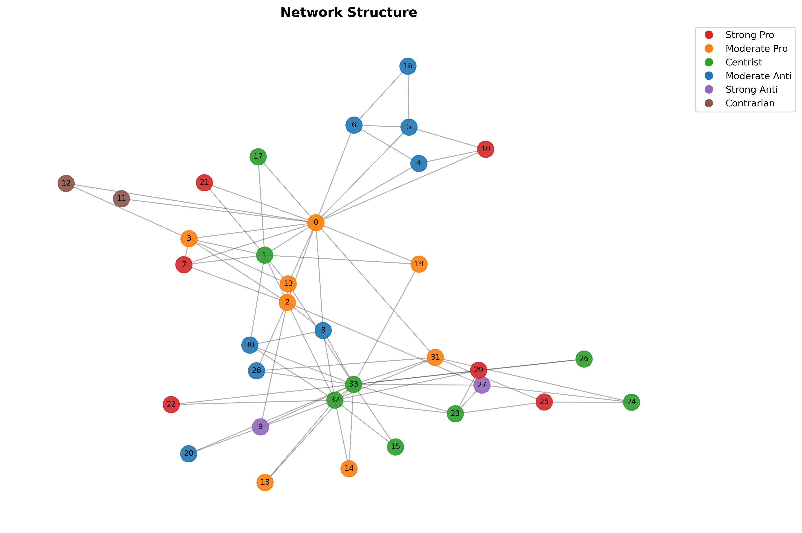


#### Evaluation Stage:

```bash
python main.py --stage evaluation --mode baseline
```

**What it does:**
- Loads 3 run histories
- **Averages all metrics** across runs
- Generates plots:
  - `avg_semantic_variance.png` - Opinion diversity over time
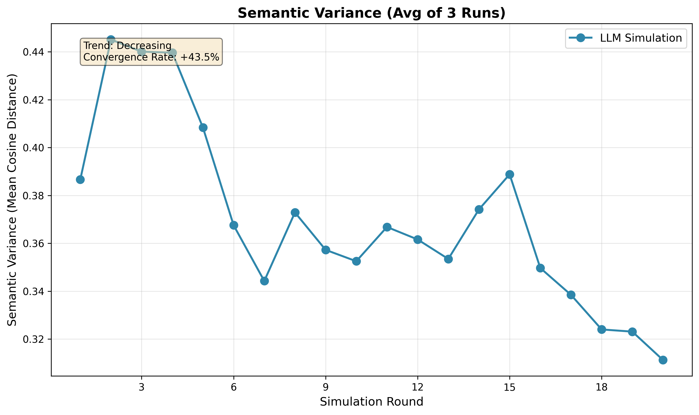
  - `avg_topic_drift.png` - Conversation focus tracking
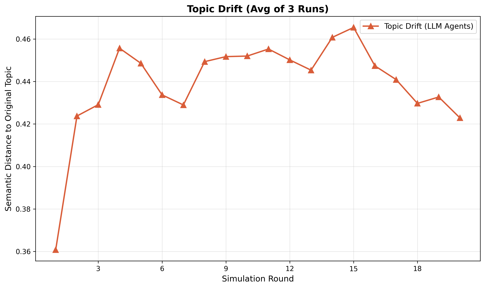
  - `avg_polarization_index.png` - Network fragmentation
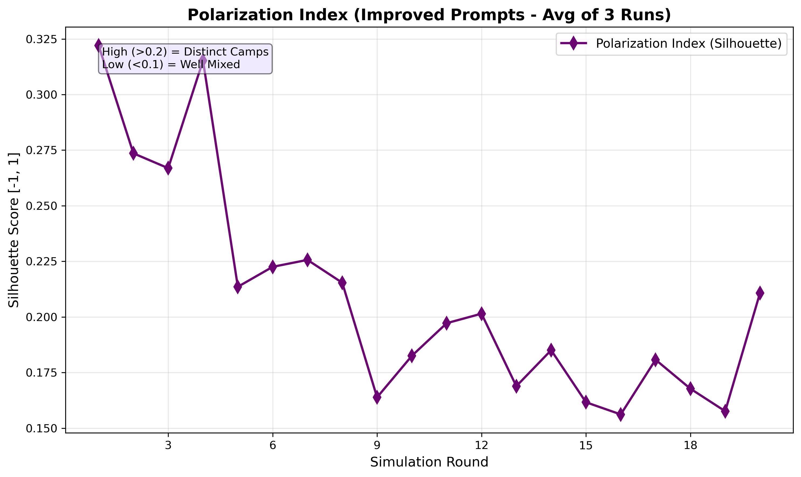


#### Visualization Stage:

```bash
python main.py --stage visualization --mode baseline
```

**What it does:**
- Loads 3 run histories
- Applies advanced dimensionality reduction (UMAP/PCA) and clustering (KMeans/Hierarchical) to high-dimensional SBERT embeddings
- Generates plots:
  - `semantic_network_snapshots.png` - Static Network Snapshots
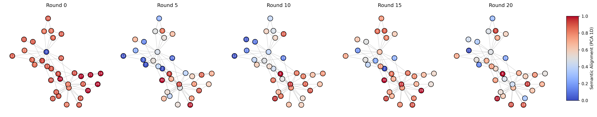
  - `semantic_network_evolution` - Dynamic Network Evolution
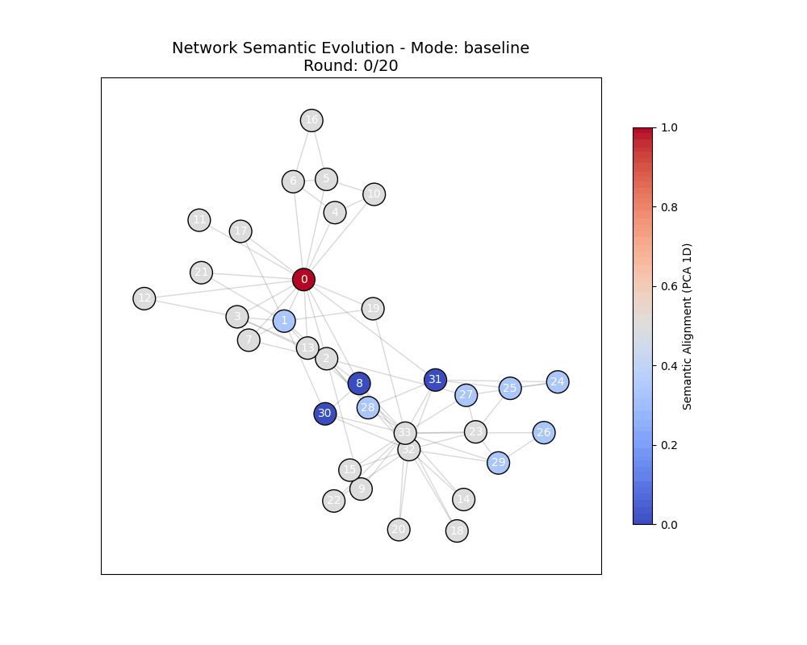

---

### Experiment 2: Bot Intervention Study

**Purpose:** Measure network resilience to disinformation

#### Generation Stage:

```bash
python main.py --stage generation --mode intervention
```

**What it does:**
- **Runs 3 replications**, each with:
  - Baseline simulation (no bot)
  - Intervention simulation (with disinformation bot)
- Bot persona spreads extreme misinformation
- Bot connects to high-degree nodes (hubs)
- Measures impact on semantic variance

**Bot Configuration:**
```python
{
  "name": "Disinformation Bot",
  "initial_opinion": "Humanoid robots are a totalitarian conspiracy 
                      by global elites to enslave humanity..."
}
```

#### Evaluation Stage:

```bash
python main.py --stage evaluation --mode intervention
```

**What it does:**
- Averages baseline and intervention results across 3 runs
- Generates comparative plots:
  - `avg_intervention_comparison.png` 
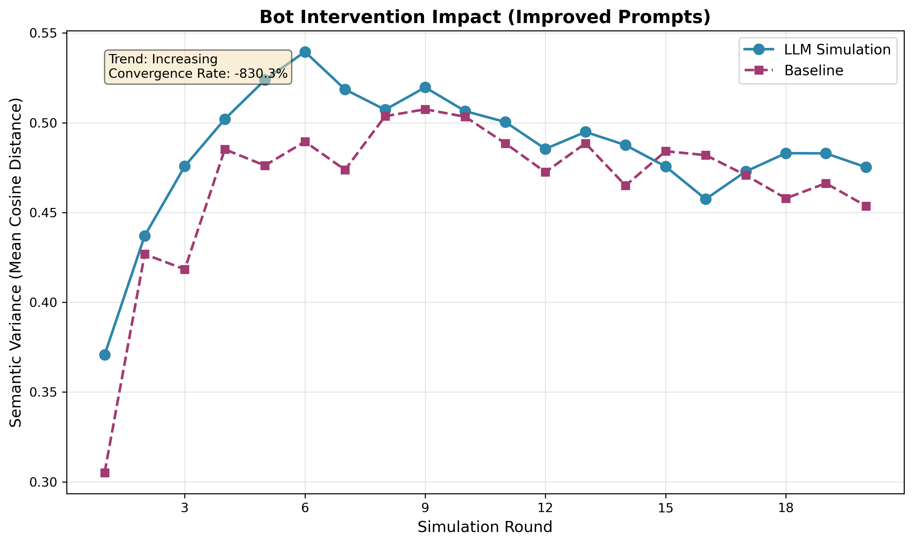
  - `avg_intervention_topic_drift.png` 
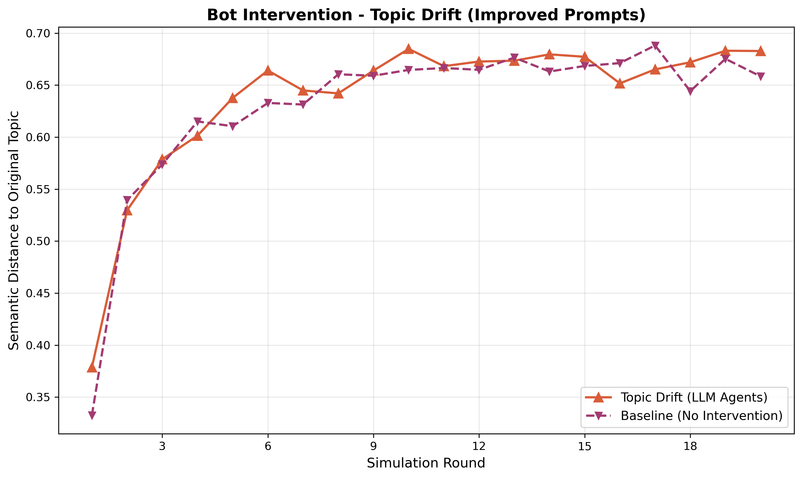
  - `avg_intervention_polarization.png` 
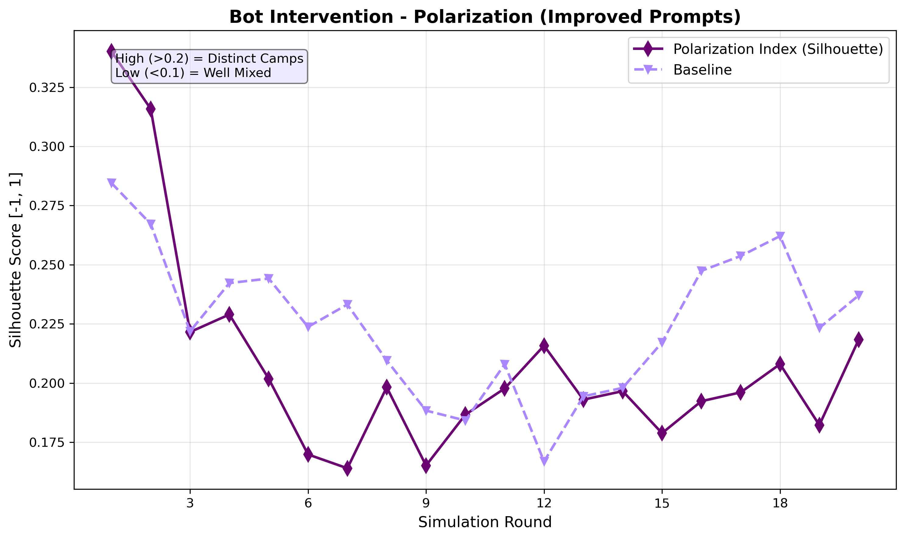


---

### Experiment 3: Topology Comparison

**Purpose:** Test how network structure affects opinion dynamics

#### Generation Stage:

```bash
python main.py --stage generation --mode comparison
```

**What it does:**
- Tests 3 network topologies:
  - **Scale-free** (Barabási-Albert): Power-law degree distribution, hubs dominate
  - **Small-world** (Watts-Strogatz): High clustering, short path lengths
  - **Random** (Erdős-Rényi): No structural bias
- **3 runs per topology = 9 total simulations**
- Same personas, different network structures


#### Evaluation Stage:

```bash
python main.py --stage evaluation --mode comparison
```

**What it does:**
- Averages results for each topology (3 runs each)
- Generates comparative plots:
  - `topology_comparison_variance.png` 
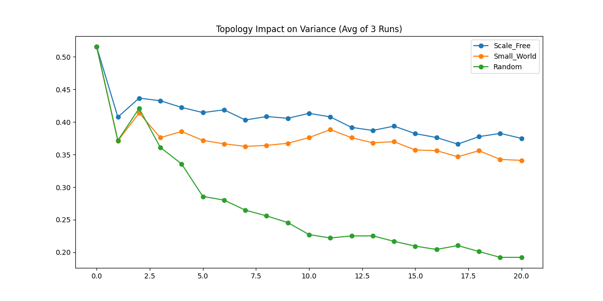
  - `topology_comparison_topic_drift.png` 
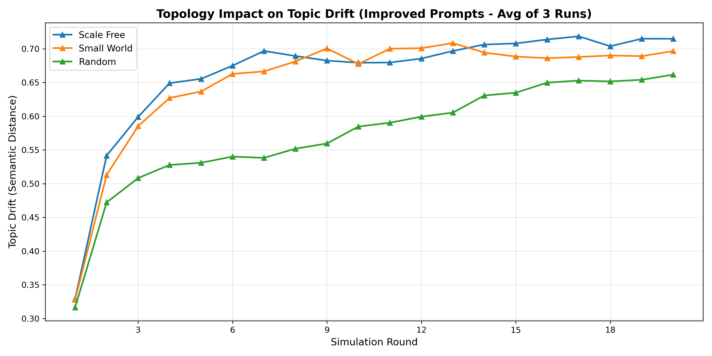
  - `topology_comparison_polarization.png` 
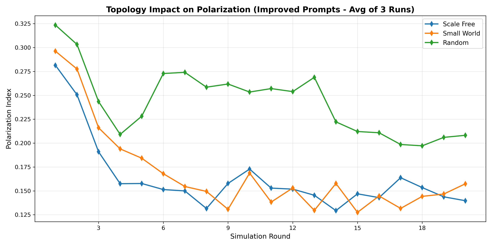


---

## 📊 Understanding the Metrics

### 1. Semantic Variance

**What it measures:** Average pairwise cosine distance between all opinion embeddings

**Formula:**
```python
variance = mean(cosine_distance(opinion[i], opinion[j])) for all pairs (i,j)
```

**Range:** 0.0 (identical opinions) to 1.0 (maximally different)

**Interpretation:**
- **0.5-0.6**: High diversity (diverse initial opinions)
- **0.3-0.4**: Moderate convergence (some consensus forming)
- **0.2-0.3**: Substantial convergence (significant agreement)
- **< 0.2**: Strong convergence (near consensus - rare for LLMs)

**Typical trajectory:**
```
Round 0:  0.55 (diverse initial opinions)
Round 5:  0.38 (rapid convergence phase)
Round 10: 0.31 (plateau - stable positions)
Round 20: 0.24 (slow drift - minor adjustments)
```

---

### 2. Polarization Index

**What it measures:** Network modularity - how fragmented into opinion clusters

**Method:** Community detection on opinion similarity graph

**Range:** -0.5 to 1.0 (typically 0.0 to 0.6)

**Interpretation:**
- **> 0.3**: Strong polarization (distinct echo chambers)
- **0.1-0.3**: Moderate polarization (some clustering)
- **< 0.1**: Weak polarization (opinions spread across network)

**What it shows:**
- High polarization = network splits into opposing camps
- Low polarization = opinions distributed across network

---

### 3. Topic Drift

**What it measures:** Semantic distance from original topic

**Method:** Cosine distance between current opinions and topic statement

**Range:** 0.0 (perfectly on-topic) to 1.0 (completely off-topic)

**Interpretation:**
- **< 0.2**: Conversation stayed focused
- **0.2-0.4**: Moderate drift (normal in discussions)
- **> 0.4**: Significant topic shift (derailment)

**Common causes:**
- Tangential arguments emerge
- Personal anecdotes dominate
- Abstract philosophical debates


## ⚙️ Configuration

### Network Settings

Edit `config.py`:

```python
# Network parameters
NETWORK_SIZE = 50  # Number of agents (must have ≥50 generated personas)
NETWORK_TYPE = "karate"  # Default: "karate", "scale_free", "small_world", "random"
SIMULATION_ROUNDS = 20  # Number of conversation rounds
```

### Topic Settings

```python
CONTROVERSIAL_TOPIC = "Should we support large-scale deployment of humanoid robots in our society?"
```

**To change topic:**
1. Update `CONTROVERSIAL_TOPIC` in `config.py`
2. Regenerate personas: `python persona_generation.py`
3. Run experiments with new personas

---

### API Provider Settings

```python
# For DeepSeek (recommended - cheapest, fastest)
API_PROVIDER = "deepseek"
API_MODEL = "deepseek-chat"

# For Claude (best quality)
API_PROVIDER = "anthropic"
API_MODEL = "claude-sonnet-4-20250514"

# For OpenAI
API_PROVIDER = "openai"
API_MODEL = "gpt-4"
```


