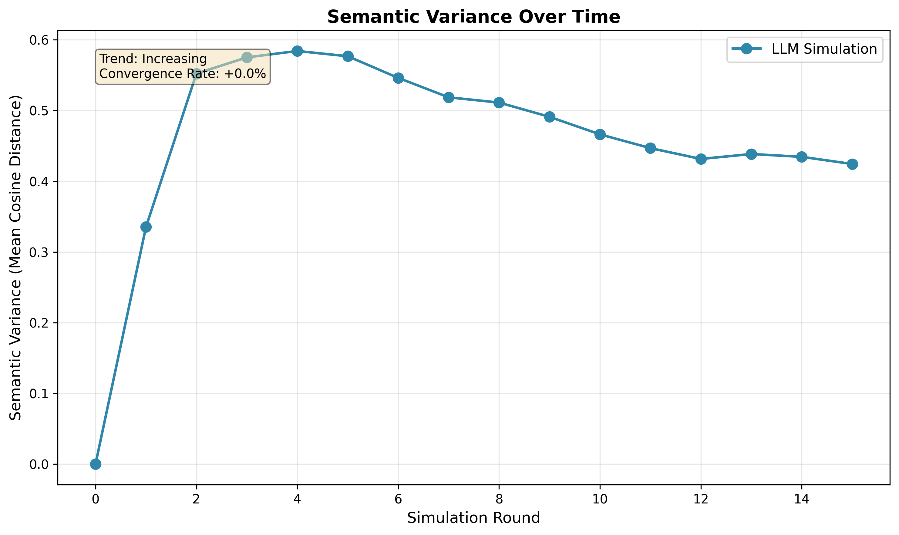
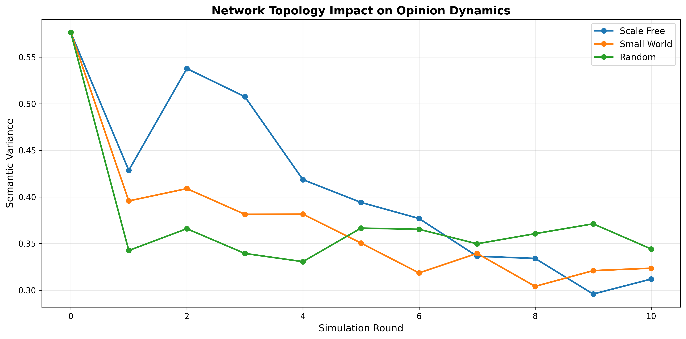

# Semantic Opinion Dynamics: LLM Agents on Complex Networks

**Replaces 50 years of weighted-average opinion dynamics with in-context learning.**

This project implements the research idea from your assignment: simulating opinion dynamics using Large Language Model agents on social networks. Instead of classical DeGroot models where opinions are scalars averaged numerically, we model agents as LLMs with text-based beliefs that update through conversation.

---

## 🎯 Project Overview

**Research Question:**  
Can LLM agents capture semantic nuances of polarization (framing, rhetoric, logical fallacies) that classical opinion dynamics miss?

**Key Innovation:**  
- **Classical approach:** Opinions are numbers in [0,1], update = weighted average of neighbors
- **Our approach:** Opinions are text, update = LLM reads neighbors' texts and generates new opinion in-context

**Experiments:**
1. **Baseline:** Track semantic variance over time using SBERT embeddings (completed)
2. **DeGroot Comparison:** Show that LLMs can maintain polarization where DeGroot converges
3. **Bot Intervention:** Measure network resilience to disinformation
4. **Topology Study:** Compare Scale-free vs. Small-world vs. Random networks

---

## 📁 Project Structure

```
├── config.py                    # Configuration & persona definitions
├── network_generation.py        # Graph creation, persona loading & visualization
├── persona_agent.py             # Agent Logic (GraphPersonaNode)
├── persona_generation.py        # Multi-threaded persona generator
├── simulation.py               # Core LLM simulation engine
├── measurement.py              # Semantic embedding analysis
├── main.py                     # Orchestration script
├── requirements.txt            # Dependencies
└── README.md                   # This file
```

---

## 🚀 Quick Start

### 1. Install Dependencies

```bash
pip install -r requirements.txt
```

### 2. Set API Key


```bash
# For Anthropic (Claude)
export ANTHROPIC_API_KEY="your-key-here"

# For Google Gemini
export GEMINI_API_KEY="your-key-here"
# Or update .env file

```

### 3. Run Baseline Simulation

```bash
python main.py --mode baseline
```

This will:
- Create a Karate Club network (34 nodes)
- Assign diverse personas
- Run 8 rounds of opinion dynamics
- Generate semantic variance plots
- Save results to `/outputs/`

---

## 🧪 Experiment Modes (Completed)


### 1. Baseline Simulation
```bash
python main.py --mode baseline
```
**Outputs:**
- `network_structure.png` - Network visualization with persona colors


- `semantic_variance.png` - Variance over time


- `sample_opinions.txt` - Opinion trajectories for 3 agents

### 2. Bot Intervention Study
```bash
python main.py --mode intervention
```
Tests network resilience by adding a high-degree "disinformation bot" node.
**Outputs:**
- `intervention_comparison.png` - Intervention Comparison


### 3. Topology Comparison
```bash
python main.py --mode comparison
```
Compares Scale-free, Small-world, and Random networks.
**Outputs:**
- `topology_comparison.png` - Topology Comparison



### 4. DeGroot Comparison
```bash
python main.py --mode degroot
```
Compares LLM semantic dynamics with classical DeGroot model.
**Outputs:**
- `llm_vs_degroot.png` - LLM VS Degroot Comparison


---

## 🎭 Persona Design

Instead of using fixed templates, we now **dynamically generate unique personas** using LLMs seeded with sociological data. Each agent in the network has a distinct psychological profile comprising four modules:

1.  **Background (Demographics)**
    *   *Age & Generation* (e.g., "24 years old, Gen Z")
    *   *Occupation & Social Class* (e.g., "Retail Worker, Working Class")
    *   *Key Experience*: A defining life event that shapes their worldview.

2.  **Personality (Big Five)**
    *   Dominant traits selected from the Big Five model (Openness, Conscientiousness, Extraversion, Agreeableness, Neuroticism) based on the persona seed.

3.  **Cognition (Values & Biases)**
    *   *Core Values*: Fundamental beliefs driving their decisions.
    *   *Cognitive Biases*: Specific logical fallacies or tendencies (e.g., "Bandwagon Effect", "Confirmation Bias") that influence how they process information.

4.  **Current State**
    *   *Recent Memory*: A mundane, relatable recent event (e.g., "Dropped my AirPods on the subway").
    *   *Emotion*: The agent's current mood, which colors their responses.

This structure allows for highly realistic and diverse interactions, as agents reason based on their unique combination of background and psychology rather than simple "Pro/Anti" labels.

---

## 📊 Measurement Methodology

### Semantic Variance
1. Encode all opinion texts using SBERT (`all-MiniLM-L6-v2`)
2. Compute pairwise cosine distances between embeddings
3. **Variance = Mean(pairwise distances)**

**Interpretation:**
- **Increasing variance** → Polarization (agents diverging)
- **Decreasing variance** → Convergence (agents agreeing)

### DeGroot Baseline
Map personas to scalars:
- Strong Pro: 0.9
- Moderate Pro: 0.65
- Centrist: 0.5
- Moderate Anti: 0.35
- Strong Anti: 0.1

Update rule: `opinion[t+1] = mean(neighbors' opinions[t])`

DeGroot **always converges** to consensus. Our LLM agents may not!

---

## ⚙️ Configuration

Edit `config.py` to customize:

```python
# API Settings
API_PROVIDER = "gemini"  # "gemini" or "anthropic" 
API_MODEL = "gemini-2.0-flash" 

# Network Settings
NETWORK_SIZE = 30
NETWORK_TYPE = "karate"  # or "scale_free", "small_world", "random"
SIMULATION_ROUNDS = 8

# Topic
CONTROVERSIAL_TOPIC = "AI Regulation"
```


