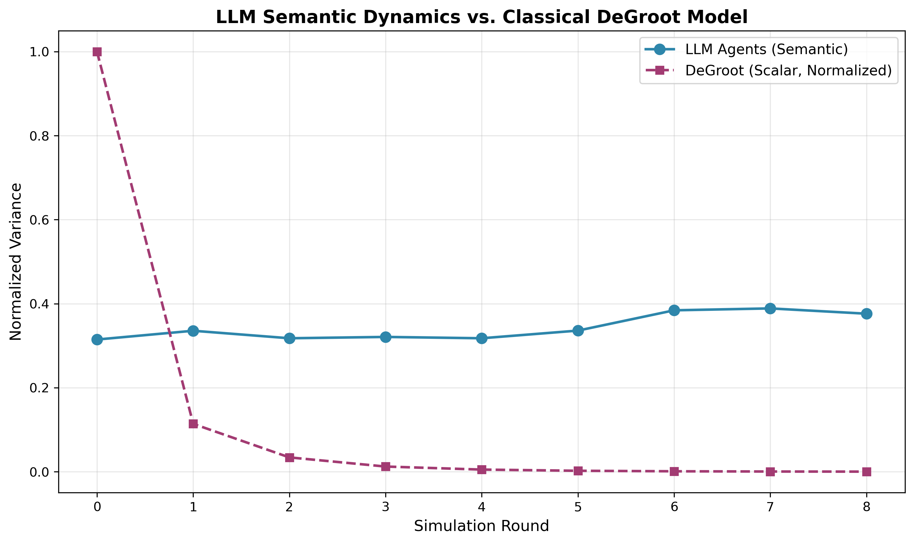
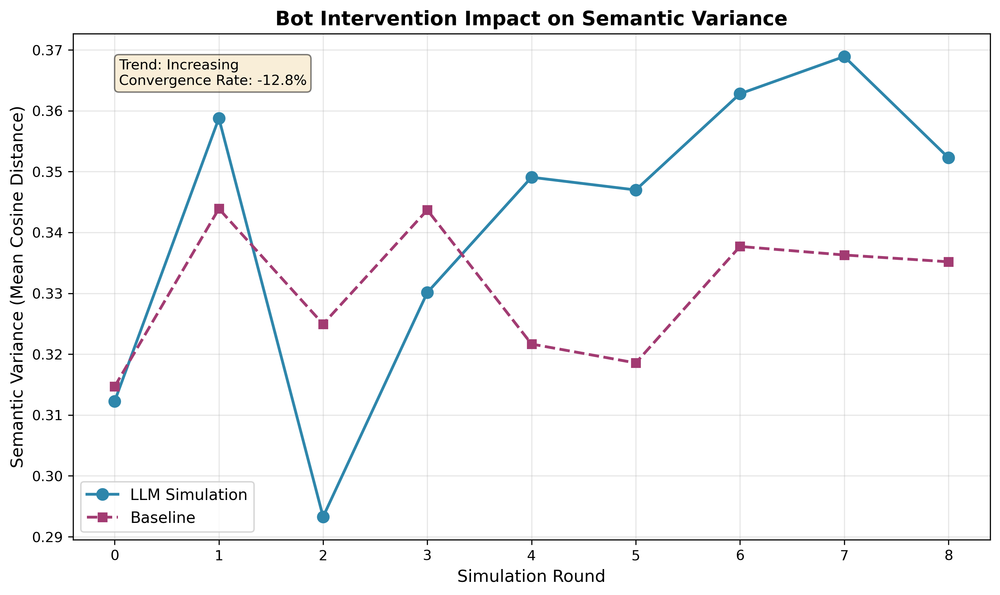
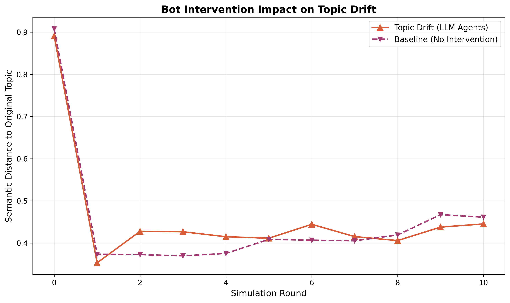
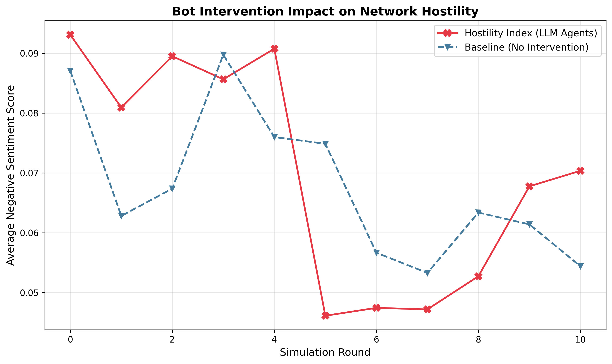

# Semantic Opinion Dynamics: LLM Agents on Complex Networks

**Replaces 50 years of weighted-average opinion dynamics with in-context learning.**

This project implements the research idea from your assignment: simulating opinion dynamics using Large Language Model agents on social networks. Instead of classical DeGroot models where opinions are scalars averaged numerically, we model agents as LLMs with text-based beliefs that update through conversation.

---

## 🎯 Project Overview

**Research Question:**  
Can LLM agents capture semantic nuances of polarization (framing, rhetoric, logical fallacies) that classical opinion dynamics miss?

**Key Innovation:**  
- **Classical approach:** Opinions are numbers in [0,1], update = weighted average of neighbors
- **Our approach:** Opinions are text, update = LLM reads neighbors' texts and generates new opinion in-context

**Experiments:**
1. **Baseline:** Track semantic variance over time using SBERT embeddings (completed)
2. **DeGroot Comparison:** Show that LLMs can maintain polarization where DeGroot converges
3. **Bot Intervention:** Measure network resilience to disinformation
4. **Topology Study:** Compare Scale-free vs. Small-world vs. Random networks

---

## 📁 Project Structure

```
.
├── config.py                    # Configuration & static persona templates
├── persona_generation.py        # LLM-based persona generator
├── persona_agent.py             # Agent class with memory
├── network_generation.py        # Graph creation & visualization
├── simulation.py                # Parallel simulation engine
├── measurement.py               # Semantic analysis (SBERT)
├── main.py                      # Orchestration script
├── requirements.txt             # Dependencies
├── .env                         # API keys (create this)
└── prompts/
    ├── seeds.json               # Weighted trait pools
    └── persona/                 # Generated persona JSONs
        ├── agent_0000.json
        ├── agent_0001.json
        └── ...
```

---

## 🚀 Quick Start

### 1. Install Dependencies

```bash
pip install -r requirements.txt
```

### 2. Set API Key


```bash
# For Deepseek
export DEEPSEEK_API_KEY="your-key-here"
```

### 3. Run Baseline Simulation

```bash
python main.py --mode baseline
```

This will:
- Create a Karate Club network (34 nodes)
- Assign diverse personas
- Run 8 rounds of opinion dynamics
- Generate semantic variance plots
- Save results to `/outputs/`

---

## 🧪 Experiment Modes (Completed)


### 1. Baseline Simulation
```bash
python main.py --mode baseline
```
**Outputs:**
- `network_structure.png` - Network visualization with persona colors


- `semantic_variance.png` - Variance over time


- `polarization_index.png` - Polarization over time


- `topic_drift.png` - Topic drift (semantic shift) over time


[//]: # (- `hostility_trend.png` - Network hostility &#40;negative sentiment&#41; over time)

[//]: # (![Hostility_Trend]&#40;outputs/hostility_trend.png&#41;)

- `sample_opinions.txt` - Opinion trajectories for 3 agents


### 2. Topology Comparison
```bash
python main.py --mode comparison
```
Compares Scale-free, Small-world, and Random networks.
**Outputs:**
- `topology_comparison_variance.png` - Topology Impact on Variance


- `topology_comparison_polarization.png` - Topology Impact on Polarization


- `topology_comparison_topic_drift.png` - Topology Impact on Topic Drift


**Analysis of Results:**
* **Overall Trend**: All topologies show a decreasing trend in semantic variance, indicating a global convergence towards consensus. This is driven by the LLM's alignment bias (RLHF), which favors balanced, moderate, and logically self-consistent responses, acting as a "low-pass filter" for extreme opinions.
* **Random Network (Green)**: 
    *   **Variance**: Lowest. The lack of local structure acts as a "highly efficient mixer," allowing mainstream opinions to propagate rapidly.
    *   **Polarization**: *Highest*. This counter-intuitive result (High Polarization + Low Variance) indicates a **"Clean Split"** phenomenon. The efficient mixing eliminates nuanced, intermediate opinions, forcing the population into two very tight, distinct clusters (Bimodal distribution). Everyone agrees to disagree in exactly the same way.
* **Scale-Free Network (Blue)**: 
    *   **Variance**: Highest. The presence of Hubs (opinion leaders) anchors diverse perspectives, preventing total convergence.
    *   **Polarization**: *Lower*. The result represents **"Disorganized Diversity"**. While opinions are diverse, they are scattered and "messy," failing to coalesce into two clean, opposing camps. The Hubs maintain their own idiosyncratic spheres of influence, blurring the lines between groups.
    *   **Topic Drift**: *Highest*. This is due to the **"Super-Spreader Effect"**. In Scale-Free networks, a few Hub nodes dominate the conversation. If a Hub agent effectively "hallucinates" or pivots to a tangential sub-topic (common with Temperature=1.0), this semantic deviation is instantly broadcast to a vast number of followers. The Hub acts as a megaphone for semantic noise, causing the entire network to drift away from the original prompt faster than in decentralized networks.
* **Small-World Network (Orange)**: Intermediate behavior. High clustering coefficients create "echo chambers" that protect local diversity better than random networks, but long-range connections eventually erode these differences.


### 3. DeGroot Comparison
```bash
python main.py --mode degroot
```
Compares LLM semantic dynamics with classical DeGroot model.
**Outputs:**
- `llm_vs_degroot.png` - LLM VS Degroot Comparison



### 4. Bot Intervention Study
```bash
python main.py --mode intervention
```
Tests network resilience by adding a high-degree "disinformation bot" node.
**Outputs:**
- `intervention_comparison.png` - Intervention Comparison


- `intervention_topic_drift.png` - Topic drift with intervention over time


- `intervention_hostility_trend.png` - Network hostility with intervention over time



---

## 🎭 Persona Design

Instead of using fixed templates, we now **dynamically generate unique personas** using LLMs seeded with sociological data. Each agent in the network has a distinct psychological profile comprising four modules:

1.  **Background (Demographics)**
    *   *Age & Generation* (e.g., "24 years old, Gen Z")
    *   *Occupation & Social Class* (e.g., "Retail Worker, Working Class")
    *   *Key Experience*: A defining life event that shapes their worldview.

2.  **Personality (Big Five)**
    *   Dominant traits selected from the Big Five model (Openness, Conscientiousness, Extraversion, Agreeableness, Neuroticism) based on the persona seed.

3.  **Cognition (Values & Biases)**
    *   *Core Values*: Fundamental beliefs driving their decisions.
    *   *Cognitive Biases*: Specific logical fallacies or tendencies (e.g., "Bandwagon Effect", "Confirmation Bias") that influence how they process information.

4.  **Current State**
    *   *Recent Memory*: A mundane, relatable recent event (e.g., "Dropped my AirPods on the subway").
    *   *Emotion*: The agent's current mood, which colors their responses.

This structure allows for highly realistic and diverse interactions, as agents reason based on their unique combination of background and psychology rather than simple "Pro/Anti" labels.

---

## 📊 Measurement Methodology

### Semantic Variance
1. Encode all opinion texts using SBERT (`all-MiniLM-L6-v2`)
2. Compute pairwise cosine distances between embeddings
3. **Variance = Mean(pairwise distances)**

**Interpretation:**
- **Increasing variance** → Polarization (agents diverging)
- **Decreasing variance** → Convergence (agents agreeing)

### Topic Drift (Semantic Shift)

1. Encode the original controversial topic (initial prompt) using SBERT.
2. Encode all opinion texts generated in the current round.
3. Compute the mean cosine distance between the agents' opinions and the original topic vector.

Interpretation:
* **Increasing drift** → Semantic shift / Distraction (agents are changing the subject, attacking each other, or moving away from the core prompt).
* **Stable/Low drift** → The network remains highly focused on the initial topic.
* *Note: Classical scalar models cannot capture this phenomenon, making this a unique advantage of LLM agents.*

### Network Hostility (Sentiment & Toxicity)

1. Analyze all opinion texts using the VADER (Valence Aware Dictionary and sEntiment Reasoner) sentiment analysis tool.
2. Extract the negative sentiment score (`neg` polarity) for each agent's generated text.
3. **Hostility Index** = Mean of the negative scores across all agents in the network.

Interpretation:
* **Increasing hostility** → Escalation of emotional contagion and toxicity (the discussion is devolving into anger or aggressiveness).
* **Low hostility** → Rational and calm discussion.

### DeGroot Baseline
Map personas to scalars:
- Strong Pro: 0.9
- Moderate Pro: 0.65
- Centrist: 0.5
- Moderate Anti: 0.35
- Strong Anti: 0.1

Update rule: `opinion[t+1] = mean(neighbors' opinions[t])`

DeGroot **always converges** to consensus. Our LLM agents may not!

---

## ⚙️ Configuration

Edit `config.py` to customize:

```python
# API Settings
API_PROVIDER = "gemini"  # "gemini" or "anthropic" 
API_MODEL = "gemini-2.0-flash" 

# Network Settings
NETWORK_SIZE = 30
NETWORK_TYPE = "karate"  # or "scale_free", "small_world", "random"
SIMULATION_ROUNDS = 8

# Topic
CONTROVERSIAL_TOPIC = "AI Regulation"
```
